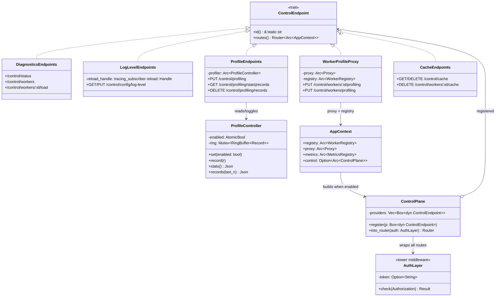
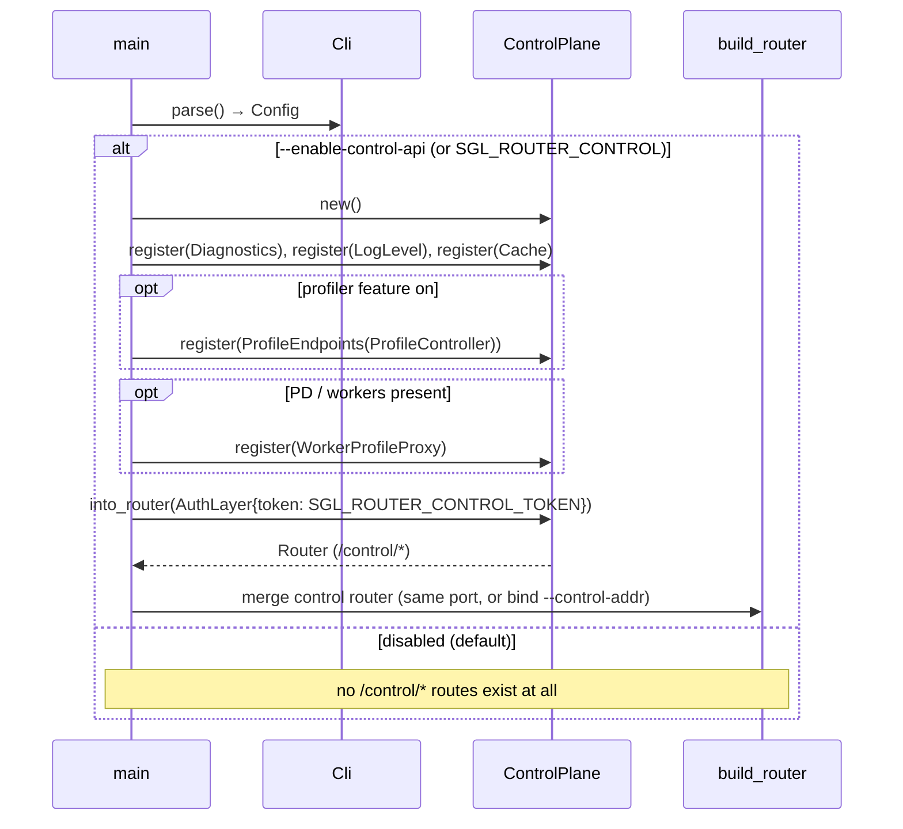
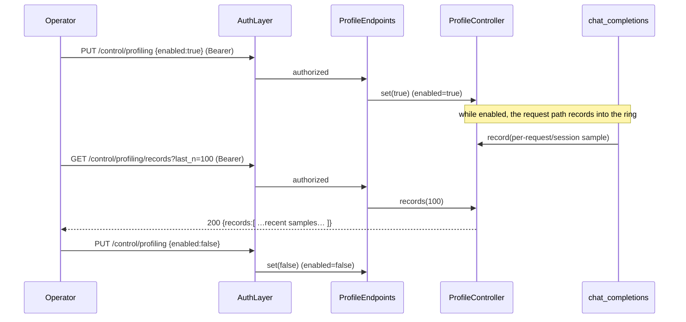
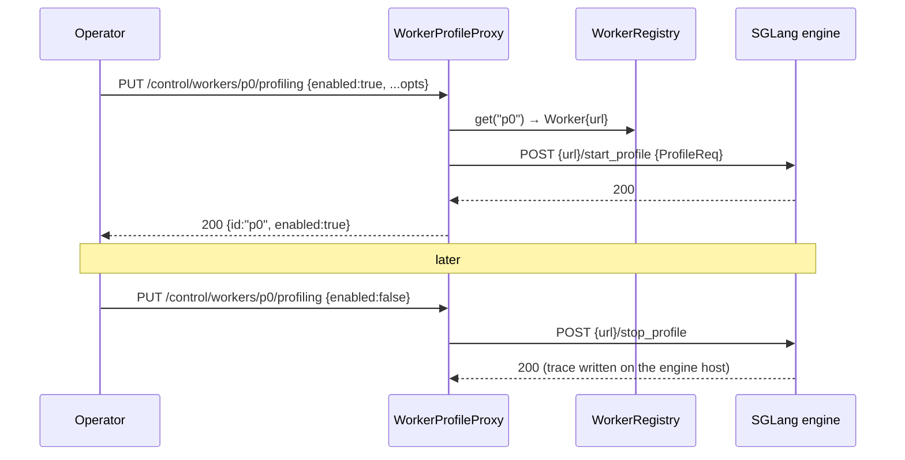
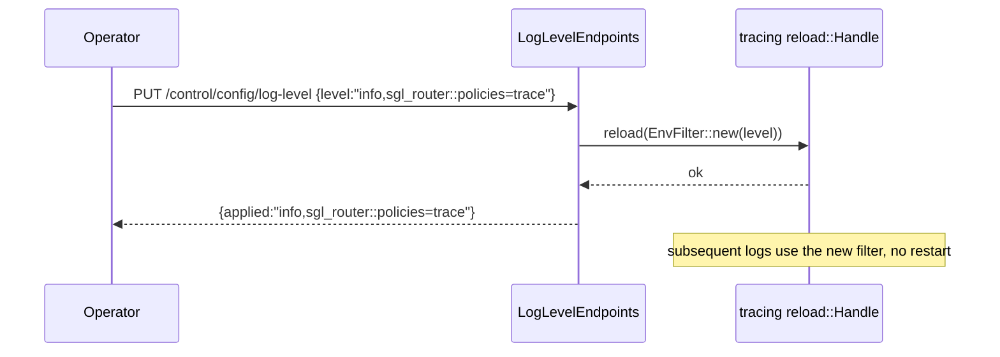

# Design — sgl-router control / profiling API

> **Status: design only (no implementation in this branch).** This document
> specifies a control-plane HTTP API for `sgl-router`, aligned with
> mori-scheduler's profiling/control surface, built on the same self-registration
> pattern as the pluggable `/metrics` collectors.

## 1. Summary

`sgl-router` today exposes a rich data plane (`/v1/chat/completions`,
`/v1/tokenize`, …), health probes (`/healthz`, `/readyz`), Prometheus
(`/metrics`), and exactly **one** control operation (`POST /flush_cache`). It has
no way to, at runtime: toggle profiling, dump internal stats, change log level,
inspect cluster/worker state, or drive per-worker GPU profiling.

mori-scheduler has all of this (`/profile/*`, `/router/config/log-level`,
`/cluster/status`, `/workers/:id/*`, and the standalone `mori-trace` collector).

This design adds a **`/control/*` control plane** to sgl-router that:

- is **off by default** and **guarded** (opt-in flag + bearer token / bind
  scope) — control endpoints mutate runtime behavior;
- is **pluggable / self-registering** — a module contributes control endpoints
  only when its feature is active (mirroring the `MetricCollector` pattern), so
  the control surface reflects exactly what is running;
- **proxies to the SGLang engines** for per-worker actions the engine already
  supports (`/start_profile`, `/stop_profile`, `/flush_cache`), reusing the
  existing `/flush_cache` fan-out shape;
- stays **measurement/ops-only** — it does not add scheduling or placement logic.

## 2. Gap vs mori-scheduler

| Capability | mori-sched | sgl-router today | this design |
|---|---|---|---|
| Fleet cache flush | `/cache/flush` | `POST /flush_cache` | `GET`/`DELETE /control/cache` + per-worker |
| Router profiling toggle | `POST /profile/control` | — | `PUT /control/profiling {enabled}` |
| Profiling stats / dump | `/profile/stats`, `/profile/dump` | — | `GET /control/profiling/{stats,records}` |
| Per-worker GPU/torch profile | `/workers/:id/profile/{start,stop}` | — | proxy → engine `/start_profile` `/stop_profile` |
| Runtime log level | `GET/PUT /router/config/log-level` | — | `GET/PUT /control/config/log-level` |
| Config reload | `POST /router/config/reload` | — | `POST /control/config:reload` (P3, best-effort) |
| Cluster status | `/cluster/status`, `/workers` | (partly via `/metrics`) | `GET /control/status`, `/control/workers` |
| Trace collector | `mori-trace` binary | — | reuse `mori-trace` (it just scrapes `/metrics`); optional `sgl-trace` later |

## 3. Design principles

1. **Separate plane, single prefix.** All control endpoints live under
   `/control/*`, never mixed with the data plane. `/metrics`, `/healthz`,
   `/readyz` stay where they are (scrapers/orchestrators depend on them).
2. **Off by default + guarded.** The control plane is built only when
   `--enable-control-api` (or `SGL_ROUTER_CONTROL`) is set. When on, every
   `/control/*` request must present `Authorization: Bearer <token>` where the
   token is `SGL_ROUTER_CONTROL_TOKEN`. Optionally bind the control plane to a
   separate address (`--control-addr 127.0.0.1:30001`) so it isn't exposed on
   the data port at all. Mutating endpoints are POST/PUT only.
3. **Pluggable / self-registering** (same ethos as `MetricCollector`). A
   `ControlEndpoint` provider registers its routes only when its module is
   active. The router's control surface = the union of what active modules
   registered + the always-on core (status, log-level, cache).
4. **Proxy, don't reinvent.** Per-worker actions (GPU profile, flush) fan out to
   the engines' existing endpoints via the proxy client, reusing
   `cache::fan_out_flush`'s pattern (breaker-bypass, per-worker result).
5. **Measurement/ops-only.** No routing/placement/eviction decisions here.

## 4. RESTful API specification

Resource-oriented, not RPC. Nouns for resources; verbs carry the intent:
**GET** read, **PUT** idempotent set-state, **DELETE** remove/clear, **POST**
only for non-idempotent actions that don't map to a resource verb.

### 4.0 Conventions
- Base path `/control`; all endpoints require `Authorization: Bearer <token>`.
- Request/response bodies are JSON (`application/json`).
- Error body: `{ "error": "<code>", "detail": "<human message>" }`.
- Status codes: `200` OK · `202` Accepted (async/fan-out kicked off) · `204` No
  Content · `400` bad body · `401` unauthorized · `404` unknown resource ·
  `409` conflict (illegal state transition) · `502` upstream worker error ·
  `503` not ready.
- Fleet (multi-worker) operations return per-worker results and use `200` when
  all succeeded, `502` when any worker failed (with the per-worker breakdown in
  the body) — mirrors today's `/flush_cache`.
- `{id}` is a `WorkerId` from the registry.

### 4.1 Cluster (read-only)
| Verb | Resource | → |
|---|---|---|
| `GET` | `/control/status` | `200` `{version, uptime_s, ready, models:[{id,policy}], workers:{prefill,decode,plain,total}}` |

### 4.2 Workers (read-only collection)
| Verb | Resource | → |
|---|---|---|
| `GET` | `/control/workers` | `200` `[{id,url,mode,healthy,cb_state,inflight,model_ids}]` |
| `GET` | `/control/workers/{id}` | `200` worker object · `404` |
| `GET` | `/control/workers/{id}/load` | `200` `{id,prefill_tokens,decode_blocks,inflight}` · `404` |

### 4.3 Router-side profiling (singleton resource + records sub-collection)
`profiling` is a resource whose `enabled` state you **set** (idempotent), and
whose captured `records` are a sub-collection you read or clear.

| Verb | Resource | Body | → |
|---|---|---|---|
| `GET` | `/control/profiling` | — | `200` `{enabled, since, record_count}` |
| `PUT` | `/control/profiling` | `{"enabled": true｜false}` | `200` `{enabled, since, record_count}` (idempotent start/stop) · `400` |
| `GET` | `/control/profiling/records` | `?last_n=N` (query) | `200` `{records:[…]}` |
| `DELETE` | `/control/profiling/records` | — | `204` (cleared) |
| `GET` | `/control/profiling/stats` | — | `200` aggregated snapshot |

*(Replaces the RPC `POST /profile {action}`: start/stop → `PUT …/profiling`,
clear → `DELETE …/profiling/records`, dump → `GET …/profiling/records`.)*

### 4.4 Per-worker GPU/torch profiling (sub-resource; proxied to engine)
Model each worker's profiler as a `profiling` sub-resource; `PUT enabled` proxies
to the engine's `/start_profile` / `/stop_profile`.

| Verb | Resource | Body | → |
|---|---|---|---|
| `PUT` | `/control/workers/{id}/profiling` | `{"enabled":true, ...profile_opts}` / `{"enabled":false}` | `200` `{id,enabled}` · `404` · `502` |
| `PUT` | `/control/workers/profiling` | `{"enabled":bool, ...}` | `200` `{results:[{id,ok}]}` · `502` (fleet) |

### 4.5 Runtime config
| Verb | Resource | Body | → |
|---|---|---|---|
| `GET` | `/control/config/log-level` | — | `200` `{level}` |
| `PUT` | `/control/config/log-level` | `{"level":"info,sgl_router::policies=trace"}` | `200` `{level}` · `400` (live `EnvFilter` reload, no restart) |
| `POST` | `/control/config:reload` | — | `202` `{reloaded:true,...}` — **P3**, non-idempotent action (re-read workers/policy tuning) |

### 4.6 Cache
Flushing a cache = removing cached representations → `DELETE`.

| Verb | Resource | → |
|---|---|---|
| `GET` | `/control/cache` | `200` per-worker cache status (proxy, best-effort) |
| `DELETE` | `/control/cache` | `200` `{results:[{id,ok}]}` · `502` (fleet flush; supersedes `POST /flush_cache`, which stays as a back-compat alias) |
| `DELETE` | `/control/workers/{id}/cache` | `200` · `404` · `502` (one worker) |

## 5. Architecture

### 5.1 Class diagram



Notes:
- `ControlEndpoint::routes()` returns an axum sub-`Router` so each provider owns
  its paths; `ControlPlane::into_router` nests them under `/control` and wraps the
  whole thing in `AuthLayer`. Same "module self-registers when active" model as
  `MetricCollector`.
- Only providers whose feature is active are registered (e.g. `ProfileEndpoints`
  only when the profiler feature is on), so the surface is feature-driven.

### 5.2 Sequence — startup (control plane assembled only when enabled)



### 5.3 Sequence — toggle router profiling + dump



### 5.4 Sequence — per-worker GPU/torch profile (proxy to engine)



### 5.5 Sequence — runtime log level



Requires initializing the subscriber in `main.rs` with a
`tracing_subscriber::reload::Layer` and storing the `Handle` (on `AppContext` or
captured by `LogLevelEndpoints`). This is the one core change to `main.rs`.

### 5.6 mori-trace compatibility

`mori-trace` scrapes each worker's `/metrics` on an interval and discovers
targets from the scheduler's `/status`. sgl-router already serves `/metrics`
(now including per-session signals via the pluggable collectors), so:

- `GET /control/status` returns a targets list in a shape `mori-trace` accepts
  (`{workers:[{url}...]}`), letting `mori-trace --mori http://<sgl-router>` work
  unchanged;
- a dedicated `sgl-trace` binary is **not** required for v1 — reuse `mori-trace`.

## 6. Security

Control endpoints change runtime behavior and can start profilers on GPUs, so:

- **Disabled by default.** No `/control/*` route exists unless
  `--enable-control-api` / `SGL_ROUTER_CONTROL` is set.
- **Bearer auth.** When enabled, `SGL_ROUTER_CONTROL_TOKEN` is required; requests
  without a matching `Authorization: Bearer` get 401. Startup refuses to enable
  the control plane if the token is unset (fail-closed).
- **Optional separate bind.** `--control-addr` serves `/control/*` on its own
  listener (e.g. localhost / mesh-only), keeping it off the public data port.
- **Least surface.** Only the providers for active features register; read-only
  diagnostics are GET, mutations are POST/PUT.

## 7. Phasing

- **P1 (core, low-risk):** `ControlPlane` + `AuthLayer` + enable flag/token;
  `GET /control/status`, `/control/workers`; `GET/PUT /control/config/log-level`
  (reload handle in `main.rs`); `DELETE /control/cache` (reuses existing
  fan-out). No engine changes.
- **P2 (profiling):** `ProfileController` + `PUT /control/profiling` +
  `GET /control/profiling/{stats,records}` + `DELETE /control/profiling/records`;
  per-worker proxy `PUT /control/workers/:id/profiling` → engine
  `/start_profile` `/stop_profile`.
- **P3 (config reload):** best-effort `POST /control/config:reload` (re-read
  worker URLs / policy tuning). Bounded scope; may stay out if risky.

## 8. Files (when implemented — not in this branch)

```
server/control/mod.rs           ControlEndpoint trait + ControlPlane + AuthLayer
server/control/diagnostics.rs   /control/status, /workers, /workers/:id/load
server/control/log_level.rs     /control/config/log-level (needs reload handle)
server/control/profile.rs       ProfileController + /control/profiling*
server/control/worker_proxy.rs  /control/workers/:id/profiling, /control/workers/:id/cache
server/app.rs                   nest ControlPlane router when enabled
main.rs                         reload-layer subscriber; build ControlPlane
config/cli.rs, config/types.rs  --enable-control-api, --control-addr, token(env)
```

## 9. Non-goals / open questions

- No scheduling/placement/eviction logic — ops/observability only.
- Auth is a static bearer token (env). mTLS / RBAC is out of scope.
- `POST /control/config:reload` scope (workers only? policies too?) — TBD in P3.
- Whether to reuse the data port (nested router + auth) or require
  `--control-addr` in production — default: same port + auth; recommend separate
  bind for exposed deployments.
